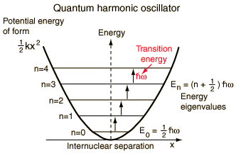

The potential of a one-dimensional harmonic oscillator in infinite potential well is
$$V(x) = \frac 12 kx^2 = \frac 12 m\omega ^2 x^2$$

The time-independent Schrodinger equation (TISE) goes

$$\frac 1{2m}\left[  \hat p^2+(m\omega x)^2   \right] \psi = E\psi$$

**Ladder operators** 

$$\hat a_\pm \equiv \dfrac{1}{\sqrt{2m\hbar \omega}} (\mp i\hat p + m\omega x) $$

The $\hat a_+$ is called **raising operator**, while $\hat a_{-}$ is **lowering operator**, ~~and obviously they are the complex conjugates of each other.~~  $i\hat p$~~is actually a real operator, as $\hat p= -i\hbar \nabla$~~. Howvere, they are the Hermitian conjugates of each other. $\hat a_-$ is sometimes written as $\hat a$, and thus $\hat a_+$ can be written as $\hat a^\dagger$

$$\hat a_-\hat a_+ = \dfrac{1}{ {2m} \hbar \omega} \left[{\hat p^2 + (m\omega x)^2} \right]  - \dfrac{i}{2\hbar} [\hat x,\hat p]=\dfrac{\hat H}{\hbar \omega} + \dfrac{1}{2} $$
The second step is according to [canonical commutation relation](#jump1) that suggest $[\hat x,\hat p ]=i\hbar$ . And $\hat a_+\hat a_- = \dfrac{\hat H}{\hbar \omega} - \dfrac{1}{2}$, so their commutator can be calculated to be $1$
$$[\hat a_-,\hat a_+] =  \hat a_-\hat a_+ - \hat a_+\hat a_- =1$$

So we can rewrite the Hamiltonian by ladder operators
$$\hat H = \hbar\omega(\hat a_-\hat a_+ - {1 \over 2})  \quad or \quad \hat H =  \hbar\omega(\hat a_+\hat a_- + {1 \over 2})  $$

With these two formulas, we are now going to prove that $\hat a_-\psi$ is a solution to the TISE with energy $E-\hbar \omega$, which is
$$\color{red}{\hat H(\hat a_-\psi) = (E-\hbar \omega)(\hat{a}_{-} \psi)}$$

in detail


$$\begin{aligned}\hat{H}\left(\hat{a}_{-} \psi\right) &=\hbar \omega\left(\hat{a}_{-} \hat{a}_{+}-\frac{1}{2}\right)\left(\hat{a}_{-} \psi\right)=\hbar \omega \hat{a}_{-}\left(\hat{a}_{+} \hat{a}_{-}-\frac{1}{2}\right) \psi \\&=\hat{a}_{-}\left[\hbar \omega\left(\hat{a}_{-} \hat{a}_{+}-1-\frac{1}{2}\right) \psi\right]=\hat{a}_{-}(\hat{H}-\hbar \omega) \psi=\hat{a}_{-}(E-\hbar \omega) \psi \\&=(E-\hbar \omega)\left(\hat{a}_{-} \psi\right)\end{aligned}$$


Similarly, $\color{red}{\hat H(\hat a_+\psi) = (E+\hbar \omega)(\hat{a}_{+} \psi)}$ is also established, and those are why they are called *ladder operators*. 

If we use lowering operator $\hat a_-$ on $\psi$ multiple times, we end up with TISE with energy $0$ and cannot use it anymore, which is to say, there exists $\psi_0$ who makes that there is no state whose wavefunction is $\hat a_-\psi_0$, as a result, its wavefunction can't be normalized for it is 0 everywhere, i.e.
$$\hat a_-\psi_0 = 0$$
Here $\psi_0$ is ground state, which can be obtained by solving the above equation, with $\hat a_- = \dfrac{1}{2m\hbar\omega}(i\hat p+m\omega x)$ and $\hat p = -i\hbar\dfrac{\partial}{\partial x}$, the equation goes
$$\dfrac{1}{2m\hbar\omega}\left( \hbar\dfrac{\partial}{\partial x}  + m\omega x\right)\psi_0 = 0$$
Solve the equation and introduce the normalization condition ($\int |\psi_0|^2 \mathrm d x= 1$), we can get the ground state
$$\psi_{0}(x)=\left(\frac{m \omega}{\pi \hbar}\right)^{1 / 4} e^{-\frac{m \omega}{2 \hbar} x^{2}}$$

We simply apply the raising operator (repeatedly) to generate the excited states, increasing the energy by $\hbar \omega$ with each step

$$\psi_{n}=\frac{1}{\sqrt{n !}}\left(\hat{a}_{+}\right)^{n} \psi_{0},\quad \text{with}\quad E_n = (n+\dfrac12 )\hbar \omega$$

The illustration are as following

 

 

How we determinated coefficient:
$$\braket{\hat a_+\psi|\hat a_+\psi} = \braket{ \psi | \hat a_-\hat a_+\psi   }= \left(\dfrac{E}{\hbar \omega} + \dfrac12\right)\braket{\psi|\psi}=    (n+1)\braket{\psi|\psi} $$
here we used $E = (n+1/2)\hbar\omega$ and $\braket{\psi_n|\psi_n} = \braket{\psi_{n+1}|\psi_{n+1}} = 1$ (normalization). Simlarly
$$\braket{\hat a_-\psi|\hat a_-\psi} = n\braket{\psi|\psi}$$
So, we get those two formulas:
$$\hat a_+\psi_n = \sqrt{n+1}\,\psi_{n+1}  \quad   \hat a_-\psi_n = \sqrt{n}\,\psi_{n-1}$$